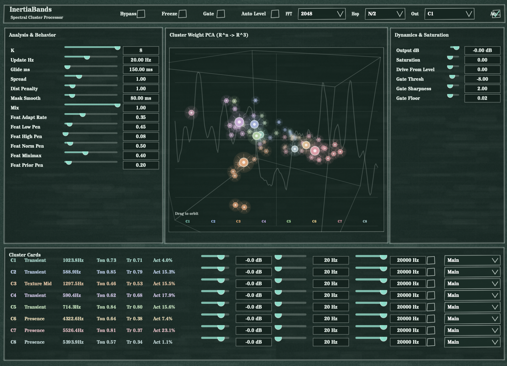

# InertiaBands

InertiaBands is a perceptual-cluster spectral processor. It analyzes audio in the frequency domain, groups perceptual bins into clusters, smooths cluster movement over time (inertia), and applies per-cluster spectral shaping.

## UI Snapshot

## Processing Pipeline (High Level)
1. STFT analysis (overlap-add framework).
2. Perceptual bin reduction for analysis only (full FFT is still used for processing).
3. Feature extraction per perceptual bin.
4. Lightweight k-means clustering on normalized features.
5. Cluster identity matching + inertial center update.
6. Soft RBF memberships per bin.
7. Membership upsampling to FFT bins.
8. Per-cluster spectral gain + HP/LP shaping (+ optional gate).
9. iSTFT overlap-add reconstruction.

## Math

### 1) STFT
For frame index `t` and FFT bin `f`:
- `X_t(f) = FFT{ x[n] * w[n - tH] }`
- `N` = FFT size, `H` = hop size, `w` = Hann window.

Output uses inverse FFT + overlap-add.

### 2) Perceptual Reduction
FFT bins are mapped to `M` perceptual bins (`M` small, fixed). For perceptual bin `i`:
- `E_i = sum_{f in bin i} |X(f)|`
- `L_i = log(eps + E_i)`

### 3) Feature Vector per Perceptual Bin
Typical feature dimensions:
- `f0 = L_i` (log-energy)
- `f1 = L_i - L_{i-1}` (local spectral slope)
- `f2 = |L_i - L_i_prev|` (spectral flux)
- `f3 = L_i - 0.5*(L_{i-1}+L_{i+1})` (peakiness / harmonic proxy)
- optional extras: logHz, brightness, flatness, transientness, confidence

Feature normalization is EMA-based:
- `mu <- (1-a)mu + a*phi`
- `var <- (1-a)var + a*(phi-mu)^2`
- `z = (phi - mu) / (sqrt(var)+eps)`

### 4) Clustering (Bounded k-means)
Given normalized features `z_i` and `K` centers `C_b`:
- assign: `a_i = argmin_b ||z_i - C_b||^2`
- update: `C_b = mean(z_i | a_i=b)`

Iterations are fixed and small for bounded runtime.

### 5) Inertia (Cluster Glide)
Centers do not jump to new targets instantly.
- `C_current <- C_current + alpha*(C_target - C_current)`
- `alpha = 1 - exp(-dt/tau)`, `tau = GlideMs / 1000`

Larger `GlideMs` => slower center movement => more stable/lagged timbral behavior.

### 6) Soft Membership (RBF)
For cluster `b` and bin `i`:
- `w_b(i) = exp( -||z_i - C_current[b]||^2 / (2*sigma^2) )`
- normalize over clusters: `w_b(i) /= sum_k w_k(i)`

`sigma` is controlled by `Spread`.

### 7) Spectral Processing
Per cluster and FFT bin frequency `f`:
- gain: `g_b = dbToLin(Gain_dB[b])`
- HP curve: `HP_b(f) = sqrt( f^2 / (f^2 + f_hp[b]^2) )`
- LP curve: `LP_b(f) = sqrt( f_lp[b]^2 / (f^2 + f_lp[b]^2) )`
- cluster multiplier: `M_b(f) = g_b * HP_b(f) * LP_b(f)`

Combined multiplier:
- `M_total(f) = sum_b w_b(f) * M_b(f)`
- `X'(f) = X(f) * M_total(f)`

### 8) Gate (optional)
Cluster salience/level drives soft gate:
- `gate_b = sigmoid( sharpness*(level_b - threshold) )`
- `G(f) = floor + (1-floor)*sum_b w_b(f)*gate_b`
- `X''(f) = X'(f) * G(f)`

## What Main Controls Do

### Global / Analysis
- `K`: number of clusters (2..8). More clusters = finer separation, higher complexity.
- `Update Hz`: how often clustering updates. Higher = more reactive.
- `Glide ms`: inertia time constant for cluster center motion.
- `Spread`: RBF width (`sigma`). Low = hard separation, high = blended masks.
- `Dist Penalty`: regularizes distance behavior; higher penalizes far assignments more.
- `Mask Smooth`: temporal smoothing of masks.
- `Mix`: wet/dry blend.

### Dynamics / Feature Behavior
- `Feat Adapt Rate`: EMA speed for feature normalization/adaptation.
- `Feat Low Pen`: penalty against very low feature weights.
- `Feat High Pen`: mild penalty against very large feature weights.
- `Feat Norm Pen`: penalty toward controlled weight norm.
- `Feat Prior Pen`: penalty toward prior/reference weights.
- `Feat Minimax`: minimax pressure to avoid one feature dominating collapse modes.

### Output / Gate / Saturation
- `Output dB`: output trim.
- `Saturation`: spectral density/soft-limiting intensity.
- `Drive From Level`: program-dependent extra drive from cluster level.
- `Gate`: enable/disable gate stage.
- `Gate Thresh`: gating threshold in level units.
- `Gate Sharpness`: sigmoid slope.
- `Gate Floor`: minimum residual gain when gated.

### Per-Cluster Controls
For each active cluster `C1..CK`:
- `Gain`: cluster gain contribution.
- `HP`: low-frequency cutoff emphasis for that cluster.
- `LP`: high-frequency cutoff emphasis for that cluster.
- `M`: mute cluster contribution.
- `Route`: output bus target for that cluster (when routing mode supports it).

### Utility Toggles
- `Bypass`: bypass processing.
- `Freeze`: hold cluster targets/structure for static spectral behavior.
- `Auto Level`: automatic level compensation behavior.
- `Advanced`: exposes full parameter set; basic mode shows core controls.

## Practical Interpretation
- Increase `K` + `Update Hz` for more detailed/reactive splitting.
- Increase `Glide ms` + `Mask Smooth` for more stable, less jittery movement.
- Lower `Spread` for more isolated clusters; raise it for cohesive broad shaping.
- Use per-cluster HP/LP + gain to sculpt distinct spectral roles (body, presence, air, etc.).
